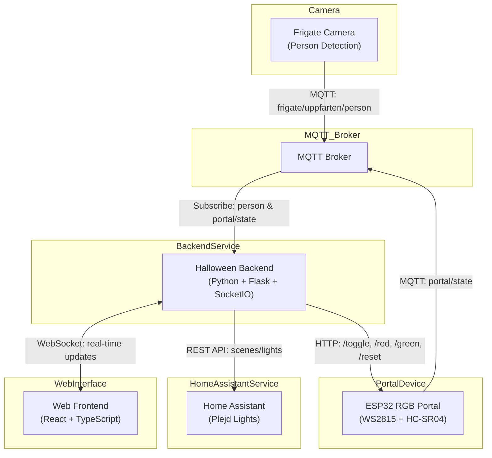
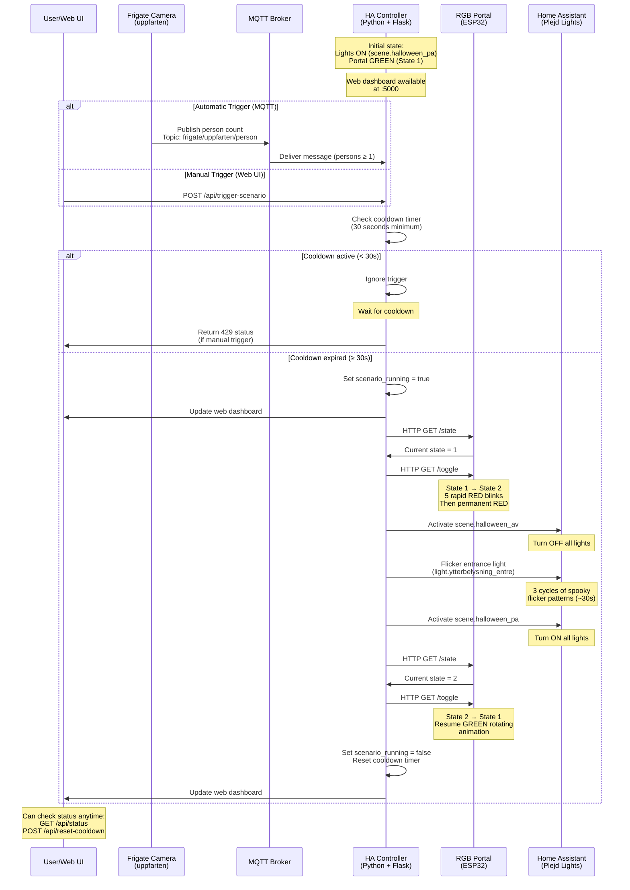

# Architecture and Flow

## System Architecture

## System Flow

## Detailed Flow

### 1. Detection Phase
- **Trigger**: Person detected in driveway by Frigate camera
- **MQTT Message**: Camera publishes person count to `frigate/uppfarten/person`
- **Cooldown Check**: Controller verifies at least 30 seconds have passed since last trigger

### 2. Activation Phase (if cooldown satisfied)
The following actions occur in parallel:

#### 2a. Portal Animation
- ESP32 receives HTTP GET request to `/toggle`
- Portal changes from **State 1** (green rotating) to **State 2**:
  - 5 rapid RED blinks (200ms on/off cycles)
  - Transitions to permanent RED light

#### 2b. Lights Out
- Home Assistant scene `scene.halloween_av` is activated
- All Plejd-controlled lights in the home turn OFF

#### 2c. Entrance Flicker
- Entrance light (`light.ytterbelysning_entre`) performs spooky flicker sequence
- 3 cycles of varying brightness and timing patterns (~30 seconds total)
- Creates atmospheric horror effect

### 3. Reset Phase
After the flicker sequence completes (~30 seconds):
- **Lights ON**: Home Assistant scene `scene.halloween_pa` restores normal lighting
- **Portal GREEN**: Portal receives HTTP GET `/toggle` to return to State 1 (green rotating animation)
- **Cooldown Reset**: Timer resets to prevent immediate re-triggering
