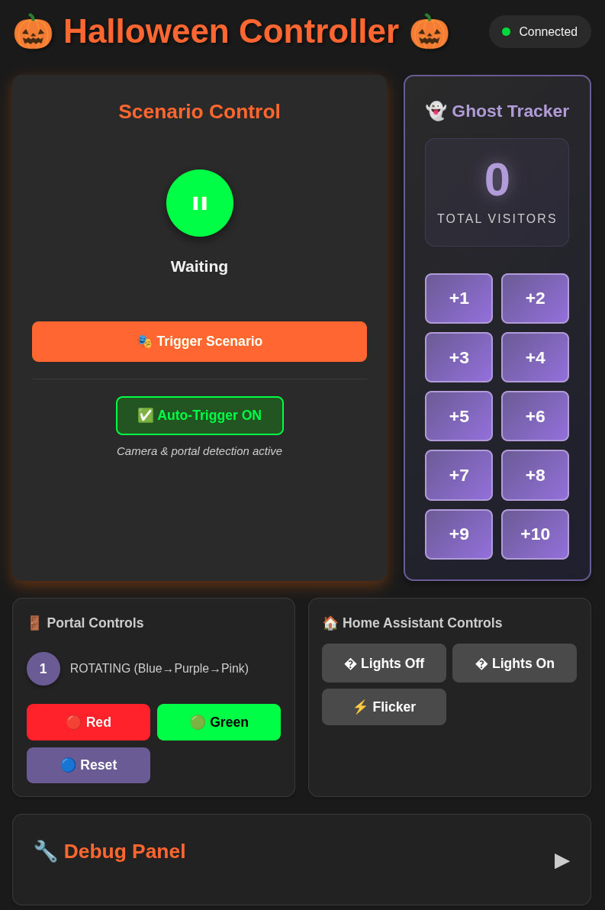

# Halloween Handler

A Halloween automation system, creating spooky entrance effects when people approach your home. 

What started as a simple bash script with manual execution has now grown into a fully interconnected microservice architecture. 

The system integrates camera detection, LED effects, smart home automation, and a modern web dashboard.  
Please see [ARCHITECTURE.md](ARCHITECTURE.md) for detailed system architecture diagrams and flow documentation.

## Components

### ha_controller

Python backend service that orchestrates the entire Halloween experience. Subscribes to MQTT for camera person detection and portal state updates, controls Home Assistant scenes and lights, manages the RGB portal via HTTP, and provides a real-time WebSocket dashboard on port 5000. See [ha_controller/README.md](ha_controller/README.md) for full documentation.

### rgb_portal

ESP32-based LED controller with WS2815 RGB strip (100 LEDs) and HC-SR04 ultrasonic sensor. Features three states: rotating gradient (default), red blink (alarm), and green blink (success). Publishes state changes to MQTT and exposes HTTP endpoints for control. Motion detection randomly triggers green or red effects. See [rgb_portal/README.md](rgb_portal/README.md) for hardware setup and firmware details.

### web_frontend

Modern React + TypeScript dashboard with real-time WebSocket updates. Displays system status, portal state, and MQTT messages. Provides manual controls for triggering scenarios and portal states. Built with Vite for fast development. See [web_frontend/SETUP.md](web_frontend/SETUP.md) for configuration and development guide.

### External Services

- **Home Assistant**: Controls Plejd lighting system via REST API.
- **MQTT Broker**: Message bus for Frigate camera person detection and portal state updates.
- **Frigate NVR**: Computer vision system that detects persons in the driveway and publishes events to MQTT.

## Getting Started

See [QUICKSTART.md](QUICKSTART.md) for setup instructions.

## Documentation

- [QUICKSTART.md](QUICKSTART.md) - Setup and installation guide
- [ARCHITECTURE.md](ARCHITECTURE.md) - System architecture and flow diagrams
- [ha_controller/README.md](ha_controller/README.md) - Backend API and configuration
- [rgb_portal/README.md](rgb_portal/README.md) - ESP32 firmware and hardware setup
- [web_frontend/SETUP.md](web_frontend/SETUP.md) - Frontend development guide

---

### 🎯 Future Enhancements

- [ ] Add support for controling audio effects
- [ ] Automate portal reset
- [ ] Create mobile app?
- [ ] Add portal state history/timeline view
- [ ] Add metrics/analytics dashboard
